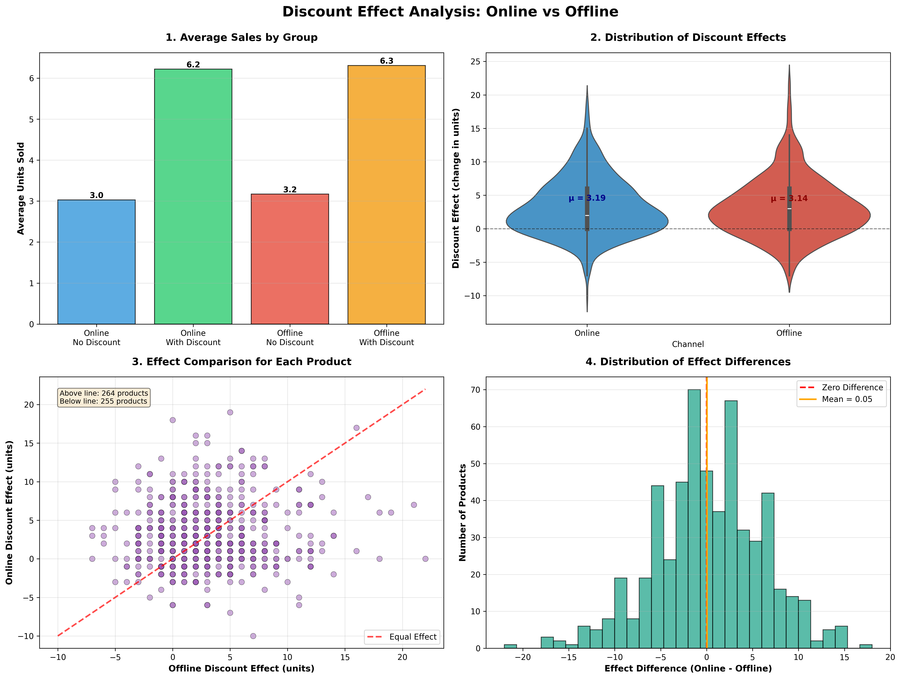
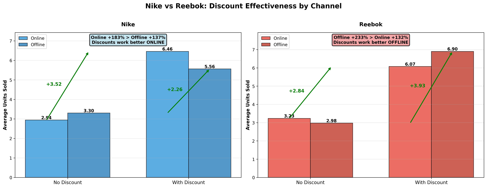
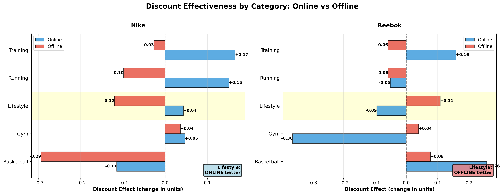
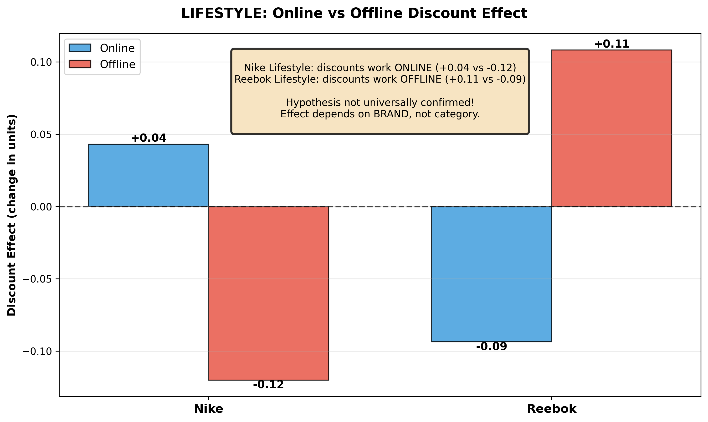

# Sports Footwear Discount Effectiveness Analysis

**Data Analysis Portfolio Project**

## 🎯 Project Overview

This project analyzes the effectiveness of discount strategies for sports footwear across online and offline sales channels. The analysis reveals unexpected brand-specific patterns that correlate with each brand's marketing philosophy.

### Key Question
**Do discounts work better for products sold online vs offline?**

### Main Findings
- **Aggregate level**: No significant difference (p = 0.832)
- **Brand level**: Strong opposite patterns discovered:
  - **Nike**: Discounts 56% more effective online (+183% vs +137%)
  - **Reebok**: Discounts 75% more effective offline (+233% vs +132%)

## 📊 Dataset

- **Period**: 2018-2026
- **Records**: 30,000 transactions
- **Brands**: 6 (Nike, Reebok, Adidas, New Balance, ASICS, Puma)
- **Categories**: 5 (Basketball, Gym, Lifestyle, Running, Training)
- **Products Analyzed**: 567 (appearing in all 4 conditions)

## 🔍 Methodology

### Analysis Framework
Compared sales performance across 4 conditions:
1. Online without discount (baseline)
2. Online with discount
3. Offline without discount (baseline)
4. Offline with discount

### Statistical Testing
- Paired t-test for hypothesis testing
- Brand-level segmentation
- Category-level analysis
- Discount size sensitivity analysis

## 📈 Key Results

### Overall Effect
| Channel | Avg Effect | Sales Increase |
|---------|-----------|----------------|
| Online | +3.19 units | +165% |
| Offline | +3.14 units | +177% |
| **Difference** | **0.05 units** | **Not significant** |

### Brand-Specific Patterns

**Nike - "Digital Brand"**
- All 5 categories perform better with online discounts
- Correlation with "Just Do It" philosophy (instant action)
- Customer behavior: Impulsive online purchasing

**Reebok - "Store Brand"**
- Mixed results by category
- Lifestyle & Gym: 75% better offline
- Training & Basketball: Better online
- Correlation with "Be More Human" philosophy (deliberate choice)
- Customer behavior: In-store product evaluation

## 💡 Business Insights

### Strategic Recommendations

**For Nike Products:**
- ✅ Maximize online discount promotions
- ✅ Email campaigns, app-based deals, promo codes
- ❌ Minimize offline discount spending (ineffective)

**For Reebok Products:**
- ✅ Prioritize in-store promotions (especially Lifestyle & Gym)
- ✅ "Deal of the day" displays, prominent pricing
- ❌ Avoid online discounts for everyday categories

**For Other Brands:**
- ✅ Balanced approach works equally well

### ROI Potential
- Reallocating discount budgets by brand could improve ROI by 56-75%
- Based on current effect size differences

## 🎓 Marketing Philosophy Connection

The analysis reveals a striking correlation between brand slogans and discount effectiveness:

**Nike: "Just Do It"** (since 1988)
- Philosophy: Instant action, universal empowerment
- → Online impulse buying behavior
- → "Just click when you see a deal"

**Reebok: "Be More Human"** (since 2015)
- Philosophy: Holistic transformation, deliberate process
- → In-store evaluation behavior
- → "Touch, feel, make conscious choice"

This demonstrates how **brand positioning directly influences purchase behavior** and optimal discount strategies.

## 📁 Project Structure

```
.
├── README.md
├── data/
│   └── global_sports_footwear_sales_2018_2026.csv
├── reports/
│   ├── executive_summary_EN.md
│   ├── discount_analysis_report_EN.md
│   └── category_analysis_report_EN.md
├── visualizations/
│   ├── discount_effect_analysis_EN.png
│   ├── nike_vs_reebok_comparison_EN.png
│   ├── category_effect_analysis_EN.png
│   └── lifestyle_hypothesis_EN.png
└── analysis/
    └── analysis_results.csv
```

## 🛠️ Tools & Technologies

- **Python**: pandas, numpy, scipy, matplotlib, seaborn
- **Statistical Methods**: Paired t-test, descriptive statistics
- **Data Visualization**: Multiple chart types for insight communication

## 📊 Visualizations

### 1. Overall Discount Effect Analysis


### 2. Nike vs Reebok Comparison


### 3. Category-Level Analysis


### 4. Lifestyle Hypothesis Test


## 🎯 Key Takeaways

1. **Aggregate data can hide valuable patterns** - While overall hypothesis failed, brand-level insights are highly actionable

2. **Brand philosophy matters** - Marketing positioning influences customer behavior beyond product attributes

3. **One-size-fits-all doesn't work** - Discount strategies must be segmented by brand, not applied universally

4. **Correlation with marketing history** - 35+ years of "Just Do It" has shaped Nike customer behavior toward instant online action

## 📝 Future Analysis Directions

- Price elasticity modeling by brand and category
- Customer lifetime value analysis by acquisition channel
- Seasonal patterns in discount effectiveness
- Geographic variations in channel preferences
- A/B testing framework for strategy validation

## 📧 Contact

This is a portfolio project demonstrating:
- Hypothesis testing and statistical analysis
- Data-driven business insights
- Marketing strategy optimization
- Clear communication of complex findings

---

**Note**: Dataset is synthetic/anonymized for portfolio purposes. Analysis methodology and insights framework are applicable to real business scenarios.
